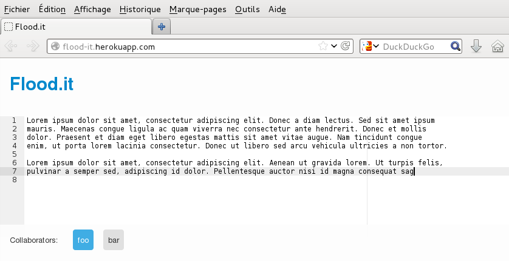

# Flood.it

Flood.it is a new lightweight collaborative text editor that uses Node.js and WebSockets.   

## Try.it

A demonstration will be deployed soon.

## Install.it

 1. Clone the repository : `git clone https://github.com/jesuspatate/Flood.it-NodeJS`
 1. Install [Node.js](http://nodejs.org/)
 1. Install dependancies for Node.js : `npm install`
 1. Run the server: `node server.js`
 1. Go to the following url with your favorite browser : `http://localhost:8080`
